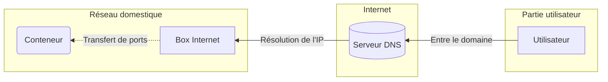

### Infrastructure serveurs

Pour déployer le site, nous utilisons plusieurs outils.

Le site est lancé sur un _conteneur LXC_, avec une image _Alpine Linux_.

> **LXC** est un système virtualisation, utilisant l'isolation comme méthode de cloisonnement au niveau du système d'exploitation.

> **Alpine Linux** est une distribution Linux ultra-légère, orientée sécurité. Souvent utilisée pour la créations de conteneurs.

LXC permet une couche de sécurité, et Alpine Linux, permet d'avoir un système facile à gérer, et qui contient "le strict minimum".

Pour faire tourner le serveur web Flask en arrière-plan, nous utilisons `pm2`, un gestionnaire de processus qui permet de facilement lancer des processus en arrière-plan.
pm2 permet aussi de relancer ces processus au lancement du conteneur.

Enfin, le conteneur est accessible depuis une interface web appelée Proxmox :

**Concernant l'exposition du conteneur sur Internet**

Pour que les utilisateurs puissent accéder au site, il faut que le conteneur ou est lancé Flask soit accessible sur Internet.

