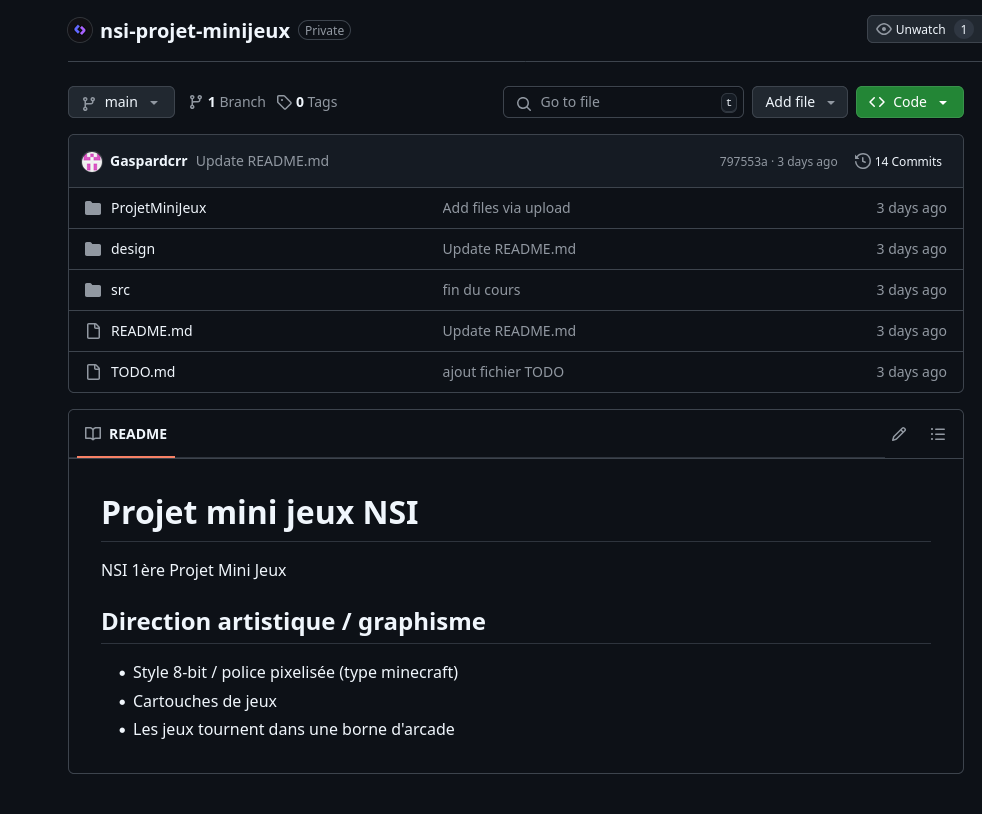
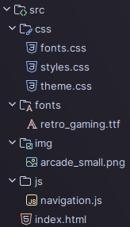
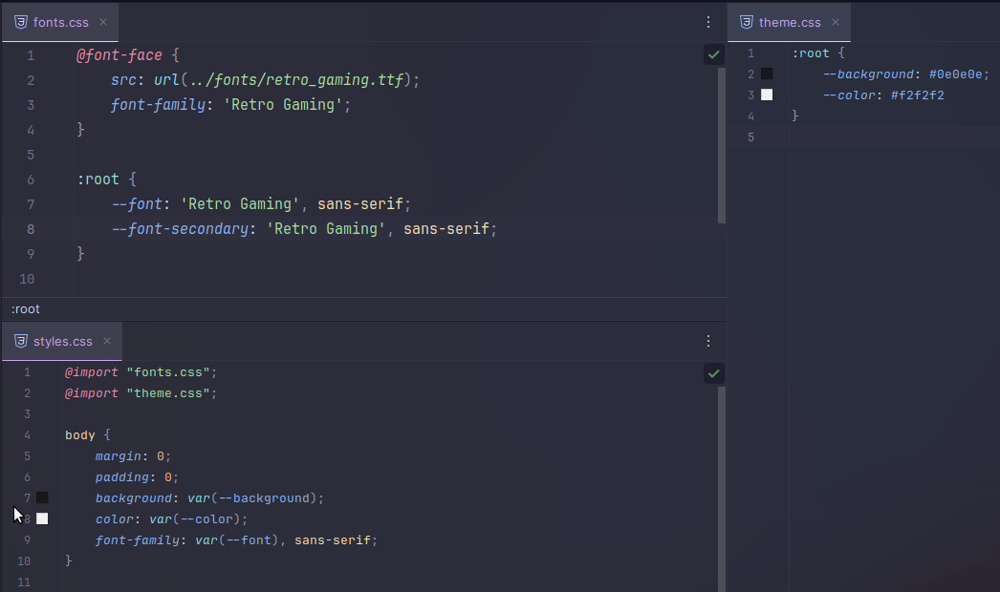
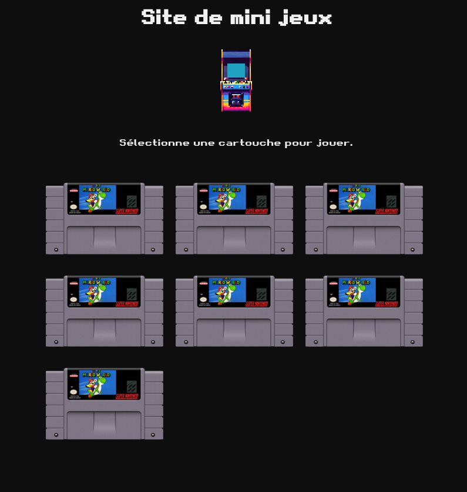
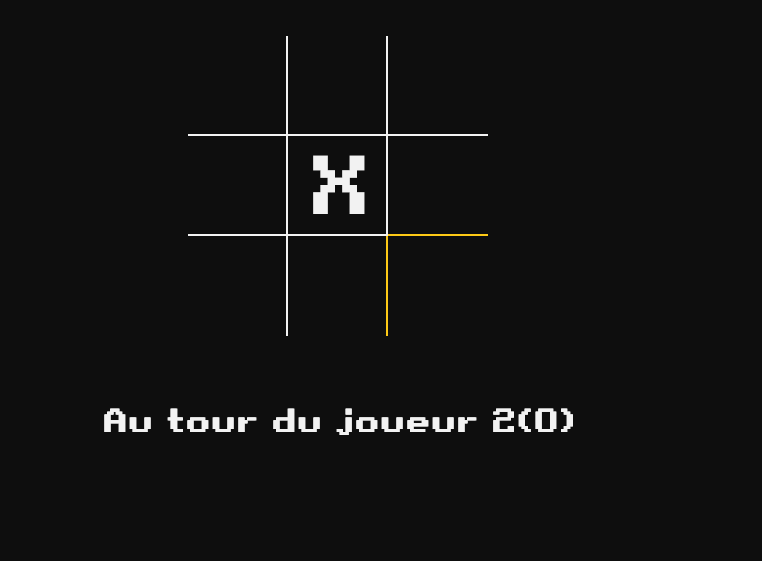
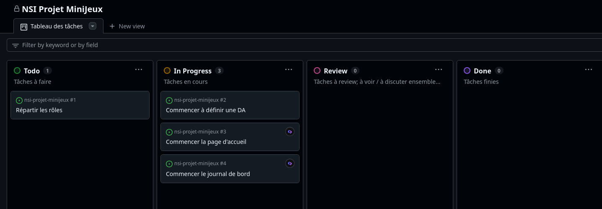

# Journal de bord

Rétrospective de l'avancée du projet chaque jour.

## Mercredi 27 Novembre

- Création du dépôt Github

- Définition de notre direction artistique
  - 8-bit
  - arcade
- Création des fichiers HTML de base

## À la maison (27 Novembre - 2 Décembre)

- Initialisation de la structure et des fichiers css

| Structure                                | Fichiers css                                |
|------------------------------------------|---------------------------------------------|
|  |  | 

- Début d'une sélection de jeux

- Création d'un écran de chargement

- Dévelopement du Morpion

## Lundi 2 Décembre

- Paramétrage d'outils pour la gestion des tâches

- Rédaction Cahier des Charges
- Finalisation Morpion
- Design: cartouche morpion, PFC & borne arcade
