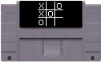
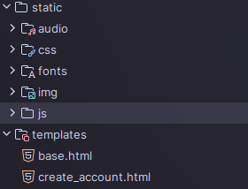
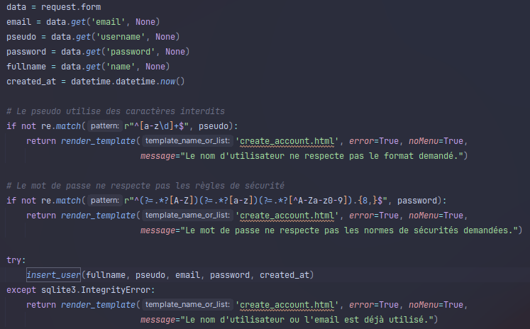

# Journal de bord

Rétrospective de l'avancée du projet chaque jour.

## Mercredi 27 Novembre

**Réunion du jour :**

Nous avons commencé par faire connaissance, puis nous avons discuté de ce que nous imaginions pour le projet.

Nous avons défini les rôles, l'organisation du projet, sa DA...

**Tâches effectuées ce jour**

- Création du dépôt Github


- Définition de notre direction artistique
  - 8-bit
  - arcade
  - rétro
- Création des fichiers HTML de base

> Grands objectifs associés : "Direction artistique "8-bit""

## À la maison (27 Novembre - 2 Décembre)

**Tâches effectuées**

- Initialisation de la structure et des fichiers css

| Structure                                | Fichiers css                                |
|------------------------------------------|---------------------------------------------|
|  |  | 

- Début d'une sélection de jeux


- Création d'un écran de chargement


- Développement du Morpion


## Lundi 2 Décembre

**Réunion du jour :**

Présentation de nos travaux du weekend : le début de page d'accueil, du morpion et l'écran de chargement.

Nous avons aussi décidé de mettre en place un système de gestion de tâches.

**Tâches effectuées ce jour**

- Paramétrage d'outils pour la gestion des tâches


- Rédaction Cahier des Charges
- Finalisation Morpion
- Design: cartouche morpion, PFC & borne arcade



## Mercredi 4 Décembre

**Réunion du jour :**

Rien de particulier.

**Tâches effectuées ce jour**

- Amélioration du morpion : ajout d'un mode de jeux contre ordinateur


- Styles des boutons


- Ajout d'une page de crédits


## À la maison (4 Décembre - 8 Décembre)

**Tâches effectuées**

- Commencement du jeu du dino


- Création des pages de connexion / création de compte

| Création de compte                       | Connexion                            |
|------------------------------------------|--------------------------------------|
|  |  |

- Commencement du jeu du juste prix


- Restylisation de la page d'accueil


- Configuration d'un rétroplanning


- Continuation du morpion
- Commencement du design de plusieurs cartouches
- Commencement du développement du OSU

> Grands objectifs associés : "Page d'accueil avec sélection du jeu" & "Comptes (connexion)"

## Lundi 8 décembre

**Réunion du jour :**

Armand : présentation du système de rétroplanning, de la nouvelle page d'accueil, du juste prix et des pages de connexion / création de compte.

Julien : présentation des nouveautés et amélioration sur le morpion, et du OSU.

Gaspard : présentation des esquisses de cartouches et des différentes assets.

Répartition de nouvelles tâche et vérification de l'avancement du projet, en fonction des fonctionnalités attendues : migration du site statique vers Flask, développement OSU...
Et vérification des images manquantes pour que Gaspard puisse les créer.

**Tâches effectuées ce jour**

- Commencement de la migration vers Flask
- Continuation OSU! & dino
- Nouvelles images pour PFC

> Grands objectifs associés : "Site dynamique avec Flask"

## Mercredi 11 décembre
**Réunion du jour :**

Mise au point rétroplanning. Continuation des tâches du Lundi. 

**Tâches effectuées ce jour**

- Images dino
- Continuation OSU!
- Continuation dino

## À la maison (11 décembre - 16 Décembre)

**Tâches effectuées**

- Explications dans le README pour la sécurité des comptes
- Migration des ressources pour flask



- Commencement de l'authentification : hashage de mots de passe & récupération des données du formulaire en python

| Hashage des mots de passes             | Code python de la création de compte |
|----------------------------------------|--------------------------------------|
|  |  | 

- Mise en place de la base de données
```sql
CREATE TABLE IF NOT EXISTS users (pseudo TEXT NOT NULL UNIQUE, name TEXT NOT NULL, password TEXT NOT NULL, email TEXT NOT NULL UNIQUE, created_at TIME NOT NULL)
CREATE TABLE IF NOT EXISTS scores (game TEXT NOT NULL, user TEXT NOT NULL, points INT NOT NULL, date TIME NOT NULL)
```
_Schéma de la BDD_

Problème : comment stocker une date ?

> En informatique, la méthode la plus simple pour stocker une date est d'utiliser de l'horodatage (le timestamp) : on va parler ici de Unix timestamp
>
> C'est le nombre de secondes écoulées depuis le 1er janvier 1970 00:00:00 UTC. C'est donc un nombre.

Sauf que en Python, manipuler une date c'est plus simple : il existe un objet appelé `datetime`.

```python
import datetime

date = datetime.datetime.now() # Date précise du moment de l'exécution
one_minute = datetime.timedelta(minutes=1) # Un durée : une minute
now_minus_one_minute = date - one_minute # La date précise, d'une minute en arrière

# on peut aussi faire des comparaisons ect....
```

Quand on va insérer de nouveau utilisateur, nous allons passer un objet appelé `datetime` en argument, qui représente une date.
Sauf que Sqlite ne connait pas cet objet...

Solution : définir un type personnalisé pour Sqlite, dans Python.
- Le principe est qu'à chaque fois que Sqlite va insérer une valeur avec le type `datetime`, il va appeler une fonction Python pour transformer cet objet, en un type reconnu par Sqlite (ici un nombre).
- Et à chaque fois que Sqlite va récupérer une valeur avec le type `TIME` dans la base, il va appeler une fonction pour transformer le nombre en objet `datetime`.

```python
import datetime
import sqlite3

def convertir_datetime_nombre(date):
    return date.timestamp()

def convertir_nombre_datetime(nombre):
    return datetime.datetime.fromtimestamp(float(nombre.decode()))

# Convertir un objet datetime en texte à l'insertion
sqlite3.register_adapter(datetime.datetime, convertir_datetime_nombre)
# Convertir du texte en objet datetime
sqlite3.register_converter("TIME", convertir_nombre_datetime)
```

- Mise en place d'une page de profil


- Continuation OSU

> Grands objectifs associés : "Site dynamique avec Flask" & "Comptes (gestion d'une base d'utilisateurs)"

## Lundi 16 décembre

**Réunion du jour :**

Présentation des tâches effectuées ce weekend : mise en place de la base de données, et de la page de profil.

Explications du fonctionnement de l'authentification, pour que tout le groupe comprenne le fonctionnement du site.

Planification des tâches de la semaine : continuation OSU, designs des cartouches OSU, Dino et Juste Prix, finalisation de l'authentification, se pencher sur l'acquisition des scores et mettre en place un anticheat.

**Tâches effectuées ce jour**

- V1 mise en ligne
- Création de compte et connexion fonctionnelle
- Avancement OSU
- Création cartouche OSU!


## Mercredi 18 Décembre

**Réunion du jour :**

Debrief des tâches effectuées le lundi.

Continuation des tâches fixées le lundi.

**Tâches effectuées ce jour**

- Continuation OSU!
- Création cartouche dino et juste prix


- Début de mise en place de l'acquisition des scores
- Mise en place d'un anticheat


## À la maison (18 décembre - 6 Janvier)

**Tâches effectuées**

- Mise en place du classement


> Pour cette partie, nous avons rencontré un problème : Comment obtenir un classement de chaque joueur, alors que l'on ne dispose que de leurs parties individuelles.
> Réponse très intéressante : découverte des jointures de table
```sql
SELECT u.pseudo, u.name, SUM(s.points) AS score, RANK() OVER (ORDER BY SUM(s.points) DESC) AS rank
FROM users u
JOIN scores s ON u.pseudo = s.user
GROUP BY u.pseudo, u.name
ORDER BY rank
```
> On récupère chaque pseudo et nom d'utilisateur dans la table `users`, on joint la table `scores` à `users` par la colonne `user` = `pseudo`, on calcule la somme des points, et on crée un "RANK" sur la somme des points pour obtenir un classement. 
- Résolutions de bugs (erreur à la connexion si l'utilisateur n'existait pas)
- Ajout d'une page d'erreur


- Mise en place d'une personnalisation du profil


- Ajout cooldown pour éviter les requêtes bloquées par l'anticheat


- Responsive du site (pour qu'il soit au moins fonctionnel sur mobile)

> Grands objectifs associés : "Page de classement"


## Lundi 6 Janvier

**Réunion du jour :**

Julien absent; il était responsable du développement du OSU!.
Nous avons donc pris la décision d'utiliser une version fonctionnelle suffisante de OSU! pour pouvoir rendre le site dans les temps.

Prévision du planning jusqu'au lundi 13 janvier : définition des tâches importantes pour rendre le site.
Notamment à propos de la sécurité des mots de passes

**Tâches effectuées ce jour**

- Commencement d'un plan pour l'oral
- Trouver un diaporama dans le style 8-bit / retro du site 


## Mercredi 8 Janvier

**Réunion du jour :**

Julien encore absent. On a donc vérifié que le OSU fonctionnait et des bugs ont été trouvés : les balles à cliquer peuvent apparaître trop haut.

Point sur le planning prévisionnel : catégorisation plus précise des tâches, et définition de tâches à réaliser le weekend.

**Tâches effectuées ce jour**

- Mise en place d'un minimum de caractère et de normes de sécurité sur les mots de passes
- Ajout des différents niveaux du OSU!
- Continuation de l'oral : rédaction de textes 

## À la maison (8 - 13 Janvier)

**Tâches effectuées**
- Rafraichissement du journal de bord
- Continuation et finalisation de l'oral (principalement des textes)
- Résolution bugs OSU (balles qui apparaissent trop haut, ou les unes sur les autres)
- Renseignement sur la conformité RGPD du site

## Lundi 13 Janvier

**Réunion du jour :**


**Tâches effectuées ce jour**

- Finalisation de l'oral
