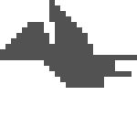
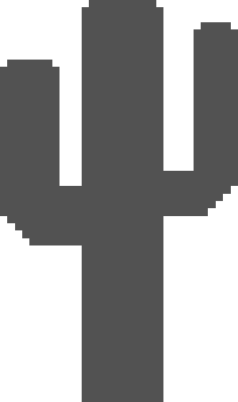
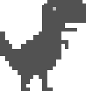
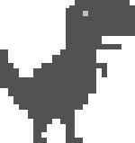
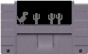

# Oral

## Critères d'évaluation

- [ ] Présentez brièvement le contexte du projet
- [ ] Énoncez les principaux objectifs du projet [1](#cahier-des-charges)
- [ ] Détaillez les principales fonctionnalités attendues du site [1](#cahier-des-charges)
- [ ] Mettez l'accent sur la manière dont vous avez implémenté ces
fonctionnalités [1](#jeux)
- [ ] Présentez votre projet
- [ ] Partagez le calendrier détaillé avec les étapes clés et les dates limites [1](#chronologie)
- [ ] Mettez en évidence les mécanismes de communication au sein de l'équipe [1](#organisation)
- [ ] Expliquez les difficultés rencontrées et les améliorations possibles [1](#points-à-améliorer)

## Plan 

- Intro
- Présentation site (montrer les fonctionnalités en direct)
- [Présentation projet](#présentation-projet)
    - [x] [Rôles](#répartition-des-rôles) + [outils utilisés](#outils-utilisés) (github, gestion des taches, vscode, piksel)
    - [x] [Cahier des charges](#cahier-des-charges)
    - [x] [Organisation](#organisation)
    - [x] [Journal](#journal)
    - [x] [DA / design](#da--design)
    - [ ] [Jeux: OSU, Bot morpion](#jeux)
    - [x] [Chronologie](#chronologie) / Déroulement du projet
- [Fonctionnalités avancées](#fonctionnalités-avancées)
    - [x] [Flask](#le-backend-avec-flask) ? concept + comment on s'en sert + Jinja
    - [x] [Authentification](#authentification) (jeton)
    - [x] [Acquisition scores](#à-propos-de-lacquisition-des-scores)
    - [x] [Base de données](#base-de-données)
    - [x] [`Infrastructure serveur`](INFRASTRUCTURE.md)
- [`Sécurité`](SECURITY.md)
- Outro: parler des points à améliorer

## Présentation projet

- Projet NSI
- Objectif d'avoir qqch rétro
- D'être organisé
- De faire pas mal de bonus

### Répartition des rôles

| Personne | Rôle                                       |
|----------|--------------------------------------------|
| Gaspard  | Designer & Co-directeur                    |
| Julien   | Développeur & Co-directeur                 |
| Armand   | Coordination, développement & Co-directeur |

### Outils utilisés
- Git  | Git est un logiciel de gestion de versions décentralisé.
- Github  | Hébergeur du git; espace de collaboration.
- VScode  | Editeur de code en ligne et a la maison
- Piskel  | OUtil pour la création de l'entiereté des design en pixel art
- Proxmox | Gestion serveur
- Github Project | assignation des taches et deadline

### Cahier des charges

Nous avons rédiger le cahier des charges durant les premières séances. Nous y avons dreser une liste des objectifs et fonctionnalités principales attendues de notre projet.
- Direction artistique "8-bit"
- Page d'accueil avec sélection du jeu
- 5 jeux: Osu, Pierre Feuille Ciseaux, Morpion, Jeu du Dino, Juste prix
- Site dynamique avec Flask
- Comptes (gestion d'une base d'utilisateurs)
- Page de classement

Puis nous avons dresser un tableau avec les fonctionnalités détaillées :

!Montrer le fichier à l'écran!

Ainsi qu'un tableau des exigences fonctionnelles :

!Montrer le fichier à l'écran!

Nous avons aussi rempli un tableau prévisionnel ainsi que la liste des livrables attendus.
Pour finir, nous avons défini les modalités de suivi de l'avancement du projet.

!Montrer le fichier à l'écran!

### Organisation

Pour pouvoir discuter en dehors des séances, nous avons créer un groupe Discord.

À chaque début de séance, nous nous réunissons pour parler des tâches réalisées en dehors des cours (nouvelle fonctionnalités ou même bugs trouvés), prévoir et se distribuer les prochaines tâches à faire, et faire un point sur l'avancement global du projet.

Pour rendre notre code facilement consultable, mais aussi organisé et versionné, nous avons utilisé l'outil git, hébergé avec Github.

Pour la gestion des tâches, nous avons utilisé le système de tâches proposé par Github: les issues (expliquer le fonctionnement + screens).

Pour une prévision et une organisation plus complète, nous avons aussi utilisé Github Project :
- Tableau Kanban des tâches
- Rétroplanning (screen + en direct ?)


### Journal

Nous avons tenu à jour le journal de bord, pour qu'il soit représentatif de la chronologie du projet.

Les contenus sont datés, et contiennent de photos : pour chaque jour, un résumé de la réunion du jour est présent, ainsi qu'un résumé des tâches réalisées.

!Montrer le fichier en temps réel!

### DA / design

- DA style 8-bit/borne d'arcade
    - inspi DA borne d'arcade jeux "style" street fighter
    - inspi cartouche Super Nintendo (inspi cartouche.png dans design)
      -version final
    - inspi logo borne d'arcade
        - inspi d'un jouet (inspi grande arcade.png dans design)
        - inspi chat gpt pour des version pixel art (inspi borne1 et 2 dans design)
        - version final
    - Font
        - libre de droit, pixel art (utiliser dans le morpion pour X et O)
    - Bouton et design general ( page de connexion etc..)
        - Design simple rentrant dans le theme
    - Couleur rétro (fluo, rose, jaune etc...)
    - Pour les jeux :
        - Conversion de tout les design classique en pixel art grace au site piskel
        - pour s'aider utiliser l'ia pour s'inspirer ou convertir des images en pixel art
        - juste prix version console -> rentre dans le theme
        - OSU :
            - bande son dans le theme borne d'arcade

### Jeux

#### Morpion

Julien, à toi...

**Bot plus performant**
[](https://mermaid.live/edit#pako:eNptUt1OwjAUfpWT3qgJ8ABcaMARExKFqFdSLsp2GDVdz-wPxjASH8f34MU828QwsVftl--vp92JlDIUQ7E29J5ulAvwnEgLvEYLKR5pRQEKcqUmK8US-v1rqA6f4MlCoOggQ3jFWMGcvNcrbXTQ6BcsnViPxcogMzykFEsPZcMx6Nlp2YZ0ZLV7Na9duclbxEZWwXgnxZ3KrbIBbqTYt8px22UWdQW3nDeliA5MK-KADuuBbAWzSylmFrwuItNqf3Ohsi06r7Tja1CNHPVXrX7W6BNuMMq2A8jPaiSnNTpQkznhzFtl0jrRnA8CVOkOXwyjibqf6t_cCQxqj7_DAB_1lgtUMP13KNPzNtOTNp1pi54o0BVKZ_z8u5osRdhggVIMeZvhWkUTpJB2z1QVAz192FQMg4vYE7HMVMBEq9yp4ghipgO5-_ZHNR-rJ0plX4iYslbGM8dRzDc_p_03aavSPw)

#### Dino

**Images**

|                                 |                          |                                                 |                                                 |
|---------------------------------|--------------------------|-------------------------------------------------|-------------------------------------------------|
|         |  |  |  |
|  |  |                         |                                                 |


**L'HTML**

```html
<div class="arcade disabled">
    <div id="menu" class="center">
        <p id="gameEndStatus">Appuyez sur "Jouer" pour commencer.</p>
        <div class="buttons">
        <button id="play">Jouer</button>
        <button onclick="goTo('/', '/static/img/arcade.png')">Retour à l'accueil</button>
        </div>
    </div>
    <div id="game" class="screen">
        <div id="status">Score: <span id="score">0</span></div>
        <div id="dino">
            
        </div>
        <div id="cactus1"></div>
        <div id="cactus2"></div>
        <div id="bird">
            
        </div>
    </div>
</div>

<div id="infos" class="center">
    <p class="hidden-mobile">Appuyez sur espace pour sauter</p>
    <p class="only-mobile block">Appuyez pour sauter</p>
</div>
```

**Styles et déplacement des dinos**
```css
#status {
    top: 2em;
    position: relative;
    left: 2em;
}

#dino {
    height: 60px;
    width: 55.8px;
    transform: translate(60px, 419px);
    position: relative;
}

#dino.jumping {
    animation: jump linear .5s;
}

.arcade.disabled #bird img {
    content: url("/static/img/bird.png")
}

#cactus1 {
    animation: cactus linear 3s infinite;
    background-image: url("/static/img/cactus1.png");
    background-size: 30px 50.6px;
    height: 50.6px;
    width: 30px;
    transform: translate(800px, 368px);
    position: relative;
}

#cactus2 {
    animation: cactus1 linear 3s infinite;
    animation-delay: 7.5s;
    background-image: url("/static/img/cactus2.png");
    background-size: 50px 39.13px;
    height: 39.13px;
    width: 50px;
    transform: translate(800px, 330px);
    position: relative;
}

#bird {
    animation: bird linear 4s infinite;
    animation-delay: 10s;
    height: 32px;
    width: 50px;
    transform: translate(800px, 10px);
    position: relative;
}

@keyframes jump {
    from {
        transform: translate(60px, 419px);
        animation-timing-function: cubic-bezier(0.33333, 0.66667, 0.66667, 1)
    }
    69.0893% {
        transform: translate(60px, 120px);
        animation-timing-function: cubic-bezier(0.33333, 0, 0.66667, 0.33333)
    }
    to {
        animation-timing-function: cubic-bezier(0.33333, 0, 0.66667, 0.33333)
    }
}

@keyframes cactus {
    from {
        transform: translate(800px, 368px);
    }
    66% {
        transform: translate(-150px, 368px);
        display: none;
    }
    66.1% {
        display: none;
        transform: translate(800px, 368px);
    }
    to {
        display: none;
    }
}

@keyframes cactus1 {}
@keyframes bird {}
```

Les images sont donc déplacées avec le CSS grâce aux animations.

**Logique et condition de défaite: Javascript**

```javascript
function isCollide(object1, object2) {
    // Check if two objects collides
    const object1Rect = object1.getBoundingClientRect()
    const object2Rect = object2.getBoundingClientRect()
    return !(
        ((object1Rect.top + object1Rect.height) < object2Rect.top) ||
        (object1Rect.top > (object2Rect.top + object2Rect.height)) ||
        ((object1Rect.left + object1Rect.width) < object2Rect.left) ||
        (object1Rect.left > (object2Rect.left + object2Rect.width))
    );
}

function isDead() {
    return isCollide(dino, cactus1) || isCollide(dino, cactus2) || isCollide(dino, bird)
}

function jump() {
    // Check if not already jumping
    if (dino.classList.contains("jumping")) return
    dino.classList.add('jumping')
    setTimeout(() => {
        dino.classList.remove('jumping')
    }, 500)
}

function engine() {
    if (isDead()) {
        playing = false
        gameEndStatus.innerText = `Votre score est ${score}.`
        scoreElement.innerText = "0"
        playButton.innerText = "Rejouer"
        sendScore(score, 'dino')
        score = 0
        menu.classList.remove("hidden")
        arcade.classList.add("disabled")
        clearInterval(scoreInterval)
        clearInterval(gameInterval)
        for (const interval of randomizationInterval) {
            clearInterval(interval)
        }
    }
}

window.addEventListener('keydown', (event) => {
    if (event.code === "Space" || event.code === "ArrowUp") {
        event.preventDefault()
        jump()
    }
})
```
Concernant la randomization des déplacement: on déplace plus ou moins les éléments sur leur axe X :
```javascript
setTimeout(() => {
    randomizationInterval.push(setInterval(() => cactus1.style.left = (Math.random() * 100) + 'px', 3000))
}, 2500)
setTimeout(() => {
    randomizationInterval.push(setInterval(() => cactus2.style.left = (Math.random() * 100) + 'px', 3000))
}, 7500 + 2500)
setTimeout(() => {
    randomizationInterval.push(setInterval(() => bird.style.left = (Math.random() * 100) + 'px', 4000))
}, 10000 + 3500)
```


- Mécanique anim css
- Mécanique mort
- Mécanique aléatoire

#### OSU

Julien, à toi...

#### Pierre Feuille Ciseaux


**Condition de victoire**
La condition de victoire est vérifiée par une équation simplifiée. On oppose l'ordinateur (`a`) à l'utilisateur (`b`).

En considérant la liste `const items = ["rock", "paper", "scissors"]`
- L'indice de pierre est `0`
- L'indice de papier est  `1`
- L'indice des ciseaux est `2`

Avec l'équation `(a + 1) % 3 == b`

| Ordinateur (`a`) | Joueur (`b`)  | Equation          | Joueur gagnant ? |
|------------------|---------------|-------------------|------------------|
| Pierre: `a=0`    | Feuille `b=1` | `(0 + 1) % 3 = 1` | `b==1` Oui       |
| Pierre: `a=0`    | Ciseaux `b=2` | `(0 + 1) % 3 = 1` | `b!=1` Non       |
| Feuille: `a=1`   | Ciseaux `b=2` | `(1 + 1) % 3 = 2` | `b==2` Oui       |
| Feuille: `a=1`   | Pierre `b=0`  | `(1 + 1) % 3 = 2` | `b!=2` Non       |
| Ciseaux: `a=2`   | Pierre `b=0`  | `(2 + 1) % 3 = 0` | `b==0` Oui         |
| Ciseaux: `a=2`   | Feuille `b=1` | `(2 + 1) % 3 = 0` | `b!=0` Non       |
TODO: finir

#### Justeprix

- Fonctionnement classique
- Fonctionnement curseur animé

Parler de commenton a implem


### Chronologie

1. Définition de l'organisation, de la direction artistique
2. Création d'une page d'accueil de sélection des jeux
3. Commencement du développement des jeux
4. Commencement de la partie backend
5. Authentification fonctionnelle + jeux fonctionnels
6. Ajout d'un classement + de l'acquisition des scores
7. Publication du site

[](https://mermaid.live/edit#pako:eNp9VM2O0zAQfpVRLm2lXgAJRK5d7WElFrQLHFAvrjNJp-vYxj9V0WrfhWvuiBfIizFx002aVuTQxuP5-b5vZvKcSVNglmeBalSkca2Bn0BBIay2zmijTEUIRQTrzA7D0cGjDGQ0rExdo5bIP2Hq0z1vP8C92WO9cZjDTdts4sgN5tK1jUiJ2Fi0jW3_hGX3UpKmzu6hQA9ms-vqlX6IXYxqfDyvcYrlUFAz4yqhyacql9cCCnI9F-EC-UA_I55zHGAzsD0qY23iOyDoPfhP9jBWA7FZ1F1gSoFgRcVizoSUEUkBJqNvG9UX49MO4-EiA3fBJPgjAEkb67AmdD6Fwbw2znLQEiwbHUKJkRT3UpJHEQ-LC2rTfKXR6U4LRaFtPIi90LJt0A98b0mPyU6zRLiLPiB8cXRIDCPckGb4n6hyR077DvGtEv5pMgQbIZ9QF4vLrGMdZyKGLVupJHkMnXOdCv2osRvhEWIg1TUfo_OjkfkuJJNitvftX1RXdO0STJTgqqgdVjwjbpDLS3NNgpTg2GvWnnn6dHFNq8-P33J4YKWNiif4m1j5806x5EL1Y3xt0d7DndB77nk-2UnGGPAQ0J_WQaj_jGdBwhpof7OnoO7M18gJaqtYxHwCA_upY-3dQOC4swU6neay45J4W2XolbWngAP6N-8G-A_c_jhQnGpzkfmr4wnlVbrGNFtmNbqaqfAn7rmrt854cGpcZzm_FliKqMI6W-sXduWhMo-_tMzy4CIuM2ditc3yUijPp2gLluCGBM9w_Wq1Qv8w5nR--QdnV_S5)


!Montrer rétro planning en temps réel!

## Fonctionnalités avancées

### Le "backend", avec Flask

C'est un peu comme les services postaux : quand j'envoie une lettre, différents acteurs entrent en jeux... Dans une application, quand j'effectue une action, c'est pareil.

On parle de frontend / backend : partie interface utilisateur visible, et partie serveur invisible. 
Cela correspondrait, lorsque j’envoie ma lettre par la poste, à toutes les interactions physiques que je vais avoir tant que le courrier est entre mes mains.
Toute la partie acheminement et traitement de mon courrier (dans laquelle je ne suis pas directement impliqué) représente la partie backend

#### Schéma de fonctionnement

[](https://mermaid.live/edit#pako:eNqNU11u2zAMvgqhhyEB3BwgGwYkdrysaIdhbl9W94G1GFutLXn6yRbUPVDP0YuNttc62V4mwIBJfvxEfqQeRWEkiaXY1eZnUaH1cPEt18DnepaLa69q5dBTsLmYw9nZx-6z9mSxVNTBF9yrEr2xY4ILd6XFtpr8N7n4ypSKQI8u5oFZag1zaPketleXFxHEWRbBeTbPxe1I1B-pLBVeGQ1X68mbDIwlgSQojNb0ixEneatXRM8NMsA9hRNAPGOE4-uzwlha3DuOzqdw2odTY5tQI5cApPfm8PI8gTjzr3Yzsns66tX1dt_oGosHhs-hQaUX7eE_Gjxn0Xs-ZaEmBztVVIqsO1UKyINquEmu_aj0Deeugq9Ie8WJ6AdtjgBbBmy0pVI5b6lhHLhehInmrbmknzWko5EOxmY0NrBgo4uNeeBecU8FS-yN_mcd4iGryzDsqUQryXawHUOrYZM-YakJAn_tIFwH8esV72ALH_r0dZLccNVrdMPMJc_85ZmFyX7UyhPXfSsi0ZBlhSVv8WNPkAvWoOHgkn8l7TDUPhe5fmIoBm-ygy7E0ttAkQit5K1MFPIoG7HcYe3YS1JxG5fjyxgeSCRa1N-NmTDWhLL6Yz39BpjiBlA)


<details>

<summary>Code mermaid</summary>


</details>

#### Introduction à Flask

> Flask est un micro framework open-source de développement web en Python.
> [wikipedia.org](https://fr.wikipedia.org/wiki/Flask_(framework))

Flask va nous permettre de :
- Renvoyer des fichiers HTML à l'utilisateur (en y injectant des variables Python, avec Jinja)
- Intercepter les formulaires envoyés

=> Lier la logique d'authentification, et la gestion de la base à l'interface utilisateur

> Jinja est un moteur de template open-source utilisé par le langage Python.
> [wikipedia.org](https://fr.wikipedia.org/wiki/Jinja_(moteur_de_template))

Jinja prend donc un fichier HTML, et le rempli des variables Python qu'on lui donne. On peut aussi faire des boucles for, et des conditions if:
```html
<div>
  
    <p>Connecté</p>
  
    <p>Pas connecté</p>
  
</div>
```

```python
render_template('example.html', logged_in=True)
```
_Exemple simple d'utilisation de Jinja_

#### Comment on s'en sert ?

Gestion de la requête pour la page d'accueil
```python
from flask import Flask

app = Flask('Site de minijeux')

@app.get('/')
def home():
    return render_template('index.html', pseudo='pseudo', logged_in=True)
```

### Authentification

L'authentification, c'est un système de contrôle d'accès à des ressources. Ici, un utilisateur connecté peut sauvegarder ses scores.

**Comment ça fonctionne ?**
1. Un utilisateur se connecte
2. Ses informations de connexion sont vérifiées par le backend : donc dans notre fichier Python
3. Si ses informations font autorité (sont valides), un jeton unique est donné à l'utilisateur : ce jeton va permettre de reconnaître l'utilisateur, et de savoir qu'il est connecté.
4. Quand l'utilisateur accède à des ressources privées, son jeton de connexion est vérifié

**Notre système d'authentification**

Nous utilisons des jetons Json Web Token : ces jetons ont l'avantage de contenir une charge utile, et d'être facilement utilisables, car c'est uyn système populaire : c'est facile de trouver une librairie Python qui implémente les JWT.

Information importante : les mots de passes ne sont pas stockés "en clair", ils sont "hashés".

_Nous allons revenir sur les jetons et les mots de passes dans la partie sécurité_

```html
<form action="/login" method="post" enctype="multipart/form-data">
    <h2>Se connecter</h2>
    <p class="grey">Pas encore inscrit ? <a onclick="goTo('/createAccount')" class="grey">S'inscrire</a></p>
    <div class="field">
        <label for="email">Email</label>
        <input required type="email" name="email" id="email" placeholder="toi@email.com">
    </div>
    <div class="field">
        <label for="password">Mot de passe</label>
        <input required type="password" name="password" id="password" placeholder="*******">
    </div>
    <div class="field">
        <button type="submit">Me connecter</button>
    </div>
</form>
```
```python
def authenticate(email: str, password: str):
    """
    Vérifie que l'utiliateur a rentré les bonnes informations de connexion : email / mot de passe
    """
    user = cursor.execute("SELECT * FROM users WHERE email=?", (email,)).fetchone()
    if user is not None:
        _, _, hashed_password, _, _, _, _ = user
        return verify_password(password, hashed_password), build_user(user)
    return False, {}


def generate_token(username: str):
    """
    Utilise le librairie jwt pour générer un jeton
    """
    return jwt.encode({"pseudo": username, "exp": datetime.datetime.now() + datetime.timedelta(days=30)}, SECRET, algorithm="HS256")


@app.route('/login', methods=['POST'])
def login():
    """
    Ce code est exécuté quand le formulaire de connexion est envoyé
    """
    data = request.form
    email = data.get('email', None)
    password = data.get('password', None)
    authenticated, user = authenticate(email, password) # On vérifie les informations de connexion
    if authenticated:
        response = make_response(redirect('/'))
        response.set_cookie('token', generate_token(user["pseudo"])) # On génère un token, et on le place dans un cookie
        return response
```

### À propos de l'acquisition des scores

L'acquisition des scores permet de sauvegarder les scores des utilisateurs.
Quand un utilisateur fini une partie, une **requête** est envoyée au serveur web, interceptée par Flask, et une logique Python sauvegarde le score.

Le fichier `sendScore.js` contient la fonction pour envoyer la requête.
```javascript
function sendScore(score, game) {
    if (!logged) return
    const data = {
        score: score,
        game: game
    }
    fetch('/sendScore', {
        method: 'POST',
        headers: {
            'Accept': 'application/json',
            'Content-Type': 'application/json'
        },
        body: JSON.stringify(data)
    })
        .then(response => response.json())
        .then(response => {
            if (!response.success) {
                // Session expired
                if (response.code == 401) goTo('/')
                errorBox.innerText = response.message
                errorBox.classList.remove('hidden')
                return
            }
            successBox.innerText = "La partie a été sauvegardée !"
            successBox.classList.remove('hidden')
        })
        .catch(err => {
            errorBox.innerText = err
            errorBox.classList.remove('hidden')
        })
}
```

Puis dans `main.py`, la logique pour sauvegarder les scores.
```python
def insert_score(game: str, user: str, points: int, created_at: datetime.datetime, win: bool | None):
    cursor.execute("INSERT INTO scores VALUES (?,?,?,?,?)", (game, user, points, created_at, win))
    database.commit()

    
def anticheat(game, score, user):
    """
    Logique d'anticheat : on verra ça après
    """
    
    
@app.post('/sendScore')
def save_score():
    try:
        data = json.loads(request.data) # On récupère la charge utile
        score = data['score']
        game = data['game']
        anticheat_ok, points = anticheat(game, int(score), user)
        if anticheat_ok:
            win = isWin(game, score)
            insert_score(game, user['pseudo'], points, datetime.datetime.now(), win)
            return {
                "success": True,
                "code": 200,
                "message": "La partie a été sauvegardée !"
            }
        return {
            "success": False,
            "code": 400,
            "message": "Cette requête a été bloquée par l'anti cheat !"
        }
    except Exception as e:
        return {
            "success": False,
            "code": 500,
            "message": "Une erreur est survenue, impossible d'enregistrer le score."
        }
```

### Base de données

Nous utilisons une base de données **Sqlite**. Les avantages de cette base sont
- qu'elle ne nécessite pas de serveur : la base de données est stockée dans un seul fichier
- qu'elle utilise le langage SQL : un langage répandu de requêtage à des bases de données
- qu'elle possède une librairie native (directement incluse dans Python) est disponible

**Schéma de la base**

| Nom de la table | Description                         |
|-----------------|-------------------------------------|
| users           | Stockages des profils utilisateurs  |
| scores          | Stockages des résultats des parties |

**Table `users`**

| Nom de la colonne (propriété) | Description                         |
|-------------------------------|-------------------------------------|
| name                          | Nom complet de l'utilisateur        |
| pseudo                        | Pseudo de l'utilisateur             |
| email                         | Email de l'utilisateur              |
| password                      | Mot de passe hashé de l'utilisateur |
| created_at                    | Date de création de l'utilisateur   |


**Table `scores`**

| Nom de la colonne (propriété) | Description                                                     |
|-------------------------------|-----------------------------------------------------------------|
| game                          | Nom du jeu parmis `morpion`, `pfc`, `osu`, `dino`, `justeprix`. |
| date                          | Date d'enregistrement de la partie                              |
| user                          | Pseudo de l'utilisateur                                         |
| points                        | Nombres de points gagnés                                        |


Dans `main.py`, pour se connecter à la base :
```python
import sqlite3

database = sqlite3.connect('database.db')
cursor = database.cursor()
cursor.execute("SELECT * FROM users") # Une requête SQL
```

La définition de notre base :
```sql
CREATE TABLE IF NOT EXISTS users (pseudo TEXT NOT NULL UNIQUE, name TEXT NOT NULL, password TEXT NOT NULL, email TEXT NOT NULL UNIQUE, created_at TIME NOT NULL, color_primary TEXT NOT NULL, color_secondary TEXT NOT NULL);
CREATE TABLE IF NOT EXISTS scores (game TEXT NOT NULL, user TEXT NOT NULL, points INT NOT NULL, date TIME NOT NULL, win BOOLEAN);
```

Exemple de requête pour ajouter un utilisateur :
```sql
INSERT INTO users VALUES ('pseudo', 'Nom Complet', '******', 'mon@email.com', 1000000000, '#fff', '#000')
```

Problème : comment stocker une date ?

> En informatique, la méthode la plus simple pour stocker une date est d'utiliser de l'horodatage (le timestamp) : on va parler ici de Unix timestamp
> 
> C'est le nombre de secondes écoulées depuis le 1er janvier 1970 00:00:00 UTC. C'est donc un nombre.

Sauf que en Python, manipuler une date c'est plus simple : il existe un objet appelé `datetime`.

```python
import datetime

date = datetime.datetime.now() # Date précise du moment de l'exécution
one_minute = datetime.timedelta(minutes=1) # Un durée : une minute
now_minus_one_minute = date - one_minute # La date précise, d'une minute en arrière

# on peut aussi faire des comparaisons ect....
```

Quand on va insérer de nouveau utilisateur, nous allons passer un objet appelé `datetime` en argument, qui représente une date.
Sauf que Sqlite ne connait pas cet objet...

Solution : définir un type personnalisé pour Sqlite, dans Python.
- Le principe est qu'à chaque fois que Sqlite va insérer une valeur avec le type `datetime`, il va appeler une fonction Python pour transformer cet objet, en un type reconnu par Sqlite (ici un nombre).
- Et à chaque fois que Sqlite va récupérer une valeur avec le type `TIME` dans la base, il va appeler une fonction pour transformer le nombre en objet `datetime`.

```python
import datetime
import sqlite3

def convertir_datetime_nombre(date):
    return date.timestamp()

def convertir_nombre_datetime(nombre):
    return datetime.datetime.fromtimestamp(float(nombre.decode()))

# Convertir un objet datetime en texte à l'insertion
sqlite3.register_adapter(datetime.datetime, convertir_datetime_nombre)
# Convertir du texte en objet datetime
sqlite3.register_converter("TIME", convertir_nombre_datetime)
```

### Schéma de fonctionnement

[](https://mermaid.live/edit#pako:eNqNU11u2zAMvgqhhyEB3BwgGwYkdrysaIdhbl9W94G1GFutLXn6yRbUPVDP0YuNttc62V4mwIBJfvxEfqQeRWEkiaXY1eZnUaH1cPEt18DnepaLa69q5dBTsLmYw9nZx-6z9mSxVNTBF9yrEr2xY4ILd6XFtpr8N7n4ypSKQI8u5oFZag1zaPketleXFxHEWRbBeTbPxe1I1B-pLBVeGQ1X68mbDIwlgSQojNb0ixEneatXRM8NMsA9hRNAPGOE4-uzwlha3DuOzqdw2odTY5tQI5cApPfm8PI8gTjzr3Yzsns66tX1dt_oGosHhs-hQaUX7eE_Gjxn0Xs-ZaEmBztVVIqsO1UKyINquEmu_aj0Deeugq9Ie8WJ6AdtjgBbBmy0pVI5b6lhHLhehInmrbmknzWko5EOxmY0NrBgo4uNeeBecU8FS-yN_mcd4iGryzDsqUQryXawHUOrYZM-YakJAn_tIFwH8esV72ALH_r0dZLccNVrdMPMJc_85ZmFyX7UyhPXfSsi0ZBlhSVv8WNPkAvWoOHgkn8l7TDUPhe5fmIoBm-ygy7E0ttAkQit5K1MFPIoG7HcYe3YS1JxG5fjyxgeSCRa1N-NmTDWhLL6Yz39BpjiBlA)


<details>

<summary>Code mermaid</summary>


</details>

# Points à améliorer

- Jeux peut être buggés (OSU, Morpion)
- Site mobile parfois pas hyper adapté
- Accessibilité (pas d'adaptation pour les mal-voyants)
- Ergonomie peut être trop pour les nerd (moins acessible)
- Jeux trop classiques: on s'est peut être trop concentré sur les fonctionnalités avancées ?
