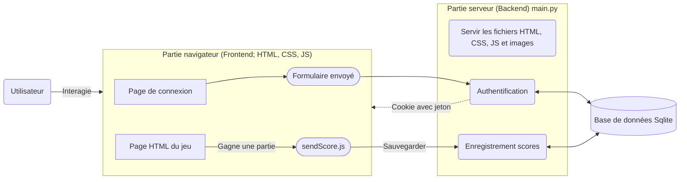
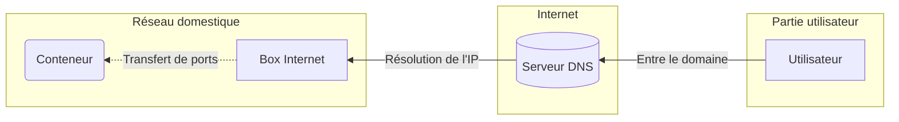

# Oral

## Critères d'évaluation

- [ ] Présentez brièvement le contexte du projet
- [ ] Énoncez les principaux objectifs du projet [1](#cahier-des-charges)
- [ ] Détaillez les principales fonctionnalités attendues du site [1](#cahier-des-charges)
- [ ] Mettez l'accent sur la manière dont vous avez implémenté ces
fonctionnalités [1](#jeux)
- [ ] Présentez votre projet
- [ ] Partagez le calendrier détaillé avec les étapes clés et les dates limites [1](#chronologie)
- [ ] Mettez en évidence les mécanismes de communication au sein de l'équipe [1](#organisation)
- [ ] Expliquez les difficultés rencontrées et les améliorations possibles [1](#points-à-améliorer)

## Plan 

- Intro
- Présentation site (montrer les fonctionnalités en direct)
- [Présentation projet](#présentation-projet)
    - [x] [Rôles](#répartition-des-rôles) + [outils utilisés](#outils-utilisés) (github, gestion des taches, vscode, piksel)
    - [ ] [Cahier des charges](#cahier-des-charges)
    - [ ] [Ogranisation](#organisation)
    - [ ] [Journal](#journal)
    - [x] [DA / design](#da--design)
    - [ ] [Jeux: OSU, Bot morpion](#jeux)
    - [ ] [Chronologie](#chronologie) / Déroulement du projet
- [Fonctionnalités avancées](#fonctionnalités-avancées)
    - [x] [Flask](#le-backend-avec-flask) ? concept + comment on s'en sert + Jinja
    - [x] [Authentification](#authentification) (jeton)
    - [x] [Acquisition scores](#à-propos-de-lacquisition-des-scores)
    - [x] [Base de données](#base-de-données)
    - [x] [Infrastructure serveur](#infrastructure-serveurs)
- [Sécurité](#sécurité)
    - [x] [Anticheat](#anticheat)
    - [x] [Sécurité BDD / mot de passes](#sécurité-bdd--mots-de-passes)
    - [x] [Sécurité jetons](#sécurité-jetons)
    - [x] [Attaques XSS (impossibles: jinja)](#protection-des-attaques-xss)
    - [x] [Injections SQL](#injections-sql)
- Outro: parler des points à améliorer

## Présentation projet

- Projet NSI
- Objectif d'avoir qqch rétro
- D'être organisé
- De faire pas mal de bonus

### Répartition des rôles

| Personne | Rôle                                       |
|----------|--------------------------------------------|
| Gaspard  | Designer & Co-directeur                    |
| Julien   | Développeur & Co-directeur                 |
| Armand   | Coordination, développement & Co-directeur |

### Outils utilisés
- Git  | Git est un logiciel de gestion de versions décentralisé.
- Github  | Hébergeur du git; espace de collaboration.
- VScode  | Editeur de code en ligne et a la maison
- Piskel  | OUtil pour la création de l'entiereté des design en pixel art
- Proxmox | Gestion serveur
- Github Project | assignation des taches et deadline

### Cahier des charges
TODO

- Parler des principaux objectifs

## Organisation

TODO: 
- Discord
- Github : code / issues
- Github Project

### Journal
TODO

### DA / design

- DA style 8-bit/borne d'arcade
    - inspi DA borne d'arcade jeux "style" street fighter
    - inspi cartouche Super Nintendo (inspi cartouche.png dans design)
      -version final
    - inspi logo borne d'arcade
        - inspi d'un jouet (inspi grande arcade.png dans design)
        - inspi chat gpt pour des version pixel art (inspi borne1 et 2 dans design)
        - version final
    - Font
        - libre de droit, pixel art (utiliser dans le morpion pour X et O)
    - Bouton et design general ( page de connexion etc..)
        - Design simple rentrant dans le theme
    - Couleur rétro (fluo, rose, jaune etc...)
    - Pour les jeux :
        - Conversion de tout les design classique en pixel art grace au site piskel
        - pour s'aider utiliser l'ia pour s'inspirer ou convertir des images en pixel art
        - juste prix version console -> rentre dans le theme
        - OSU :
            - bande son dans le theme borne d'arcade

### Jeux
TODO

Parler de commenton a implem

### Chronologie
TODO

## Fonctionnalités avancées

### Le "backend", avec Flask

#### Schéma de fonctionnement

[](https://mermaid.live/edit#pako:eNqNU11u2zAMvgqhhyEB3BwgGwYkdrysaIdhbl9W94G1GFutLXn6yRbUPVDP0YuNttc62V4mwIBJfvxEfqQeRWEkiaXY1eZnUaH1cPEt18DnepaLa69q5dBTsLmYw9nZx-6z9mSxVNTBF9yrEr2xY4ILd6XFtpr8N7n4ypSKQI8u5oFZag1zaPketleXFxHEWRbBeTbPxe1I1B-pLBVeGQ1X68mbDIwlgSQojNb0ixEneatXRM8NMsA9hRNAPGOE4-uzwlha3DuOzqdw2odTY5tQI5cApPfm8PI8gTjzr3Yzsns66tX1dt_oGosHhs-hQaUX7eE_Gjxn0Xs-ZaEmBztVVIqsO1UKyINquEmu_aj0Deeugq9Ie8WJ6AdtjgBbBmy0pVI5b6lhHLhehInmrbmknzWko5EOxmY0NrBgo4uNeeBecU8FS-yN_mcd4iGryzDsqUQryXawHUOrYZM-YakJAn_tIFwH8esV72ALH_r0dZLccNVrdMPMJc_85ZmFyX7UyhPXfSsi0ZBlhSVv8WNPkAvWoOHgkn8l7TDUPhe5fmIoBm-ygy7E0ttAkQit5K1MFPIoG7HcYe3YS1JxG5fjyxgeSCRa1N-NmTDWhLL6Yz39BpjiBlA)


<details>

<summary>Code mermaid</summary>





</details>

#### Introduction à Flask

> Flask est un micro framework open-source de développement web en Python.
> [wikipedia.org](https://fr.wikipedia.org/wiki/Flask_(framework))

Flask va nous permettre de :
- Renvoyer des fichiers HTML à l'utilisateur (en y injectant des variables Python, avec Jinja)
- Intercepter les formulaires envoyés

=> Lier la logique d'authentification, et la gestion de la base à l'interface utilisateur

> Jinja est un moteur de template open-source utilisé par le langage Python.
> [wikipedia.org](https://fr.wikipedia.org/wiki/Jinja_(moteur_de_template))

Jinja prend donc un fichier HTML, et le rempli des variables Python qu'on lui donne. On peut aussi faire des boucles for, et des conditions if:
```html
<div>
  
    <p>Connecté</p>
  
    <p>Pas connecté</p>
  
</div>
```

```python
render_template('example.html', logged_in=True)
```
_Exemple simple d'utilisation de Jinja_

#### Comment on s'en sert ?

Gestion de la requête pour la page d'accueil
```python
from flask import Flask

app = Flask('Site de minijeux')

@app.get('/')
def home():
    return render_template('index.html', pseudo='pseudo', logged_in=True)
```

### Authentification

L'authentification, c'est un système de contrôle d'accès à des ressources. Ici, un utilisateur connecté peut sauvegarder ses scores.

**Comment ça fonctionne ?**
1. Un utilisateur se connecte
2. Ses informations de connexion sont vérifiées par le backend : donc dans notre fichier Python
3. Si ses informations font autorité (sont valides), un jeton unique est donné à l'utilisateur : ce jeton va permettre de reconnaître l'utilisateur, et de savoir qu'il est connecté.
4. Quand l'utilisateur accède à des ressources privées, son jeton de connexion est vérifié

**Notre système d'authentification**

Nous utilisons des jetons Json Web Token : ces jetons ont l'avantage de contenir une charge utile, et d'être facilement utilisables, car c'est uyn système populaire : c'est facile de trouver une librairie Python qui implémente les JWT.

Information importante : les mots de passes ne sont pas stockés "en clair", ils sont "hashés".

_Nous allons revenir sur les jetons et les mots de passes dans la partie sécurité_

```html
<form action="/login" method="post" enctype="multipart/form-data">
    <h2>Se connecter</h2>
    <p class="grey">Pas encore inscrit ? <a onclick="goTo('/createAccount')" class="grey">S'inscrire</a></p>
    <div class="field">
        <label for="email">Email</label>
        <input required type="email" name="email" id="email" placeholder="toi@email.com">
    </div>
    <div class="field">
        <label for="password">Mot de passe</label>
        <input required type="password" name="password" id="password" placeholder="*******">
    </div>
    <div class="field">
        <button type="submit">Me connecter</button>
    </div>
</form>
```
```python
def authenticate(email: str, password: str):
    """
    Vérifie que l'utiliateur a rentré les bonnes informations de connexion : email / mot de passe
    """
    user = cursor.execute("SELECT * FROM users WHERE email=?", (email,)).fetchone()
    if user is not None:
        _, _, hashed_password, _, _, _, _ = user
        return verify_password(password, hashed_password), build_user(user)
    return False, {}


def generate_token(username: str):
    """
    Utilise le librairie jwt pour générer un jeton
    """
    return jwt.encode({"pseudo": username, "exp": datetime.datetime.now() + datetime.timedelta(days=30)}, SECRET, algorithm="HS256")


@app.route('/login', methods=['POST'])
def login():
    """
    Ce code est exécuté quand le formulaire de connexion est envoyé
    """
    data = request.form
    email = data.get('email', None)
    password = data.get('password', None)
    authenticated, user = authenticate(email, password) # On vérifie les informations de connexion
    if authenticated:
        response = make_response(redirect('/'))
        response.set_cookie('token', generate_token(user["pseudo"])) # On génère un token, et on le place dans un cookie
        return response
```

### À propos de l'acquisition des scores

L'acquisition des scores permet de sauvegarder les scores des utilisateurs.
Quand un utilisateur fini une partie, une **requête** est envoyée au serveur web, interceptée par Flask, et une logique Python sauvegarde le score.

Le fichier `sendScore.js` contient la fonction pour envoyer la requête.
```javascript
function sendScore(score, game) {
    if (!logged) return
    const data = {
        score: score,
        game: game
    }
    fetch('/sendScore', {
        method: 'POST',
        headers: {
            'Accept': 'application/json',
            'Content-Type': 'application/json'
        },
        body: JSON.stringify(data)
    })
        .then(response => response.json())
        .then(response => {
            if (!response.success) {
                // Session expired
                if (response.code == 401) goTo('/')
                errorBox.innerText = response.message
                errorBox.classList.remove('hidden')
                return
            }
            successBox.innerText = "La partie a été sauvegardée !"
            successBox.classList.remove('hidden')
        })
        .catch(err => {
            errorBox.innerText = err
            errorBox.classList.remove('hidden')
        })
}
```

Puis dans `main.py`, la logique pour sauvegarder les scores.
```python
def insert_score(game: str, user: str, points: int, created_at: datetime.datetime, win: bool | None):
    cursor.execute("INSERT INTO scores VALUES (?,?,?,?,?)", (game, user, points, created_at, win))
    database.commit()

    
def anticheat(game, score, user):
    """
    Logique d'anticheat : on verra ça après
    """
    
    
@app.post('/sendScore')
def save_score():
    try:
        data = json.loads(request.data) # On récupère la charge utile
        score = data['score']
        game = data['game']
        anticheat_ok, points = anticheat(game, int(score), user)
        if anticheat_ok:
            win = isWin(game, score)
            insert_score(game, user['pseudo'], points, datetime.datetime.now(), win)
            return {
                "success": True,
                "code": 200,
                "message": "La partie a été sauvegardée !"
            }
        return {
            "success": False,
            "code": 400,
            "message": "Cette requête a été bloquée par l'anti cheat !"
        }
    except Exception as e:
        return {
            "success": False,
            "code": 500,
            "message": "Une erreur est survenue, impossible d'enregistrer le score."
        }
```

### Base de données

Nous utilisons une base de données **Sqlite**. Les avantages de cette base sont
- qu'elle ne nécessite pas de serveur : la base de données est stockée dans un seul fichier
- qu'elle utilise le langage SQL : un langage répandu de requêtage à des bases de données
- qu'elle possède une librairie native (directement incluse dans Python) est disponible

**Schéma de la base**

| Nom de la table | Description                         |
|-----------------|-------------------------------------|
| users           | Stockages des profils utilisateurs  |
| scores          | Stockages des résultats des parties |

**Table `users`**

| Nom de la colonne (propriété) | Description                         |
|-------------------------------|-------------------------------------|
| name                          | Nom complet de l'utilisateur        |
| pseudo                        | Pseudo de l'utilisateur             |
| email                         | Email de l'utilisateur              |
| password                      | Mot de passe hashé de l'utilisateur |
| created_at                    | Date de création de l'utilisateur   |


**Table `scores`**

| Nom de la colonne (propriété) | Description                                                     |
|-------------------------------|-----------------------------------------------------------------|
| game                          | Nom du jeu parmis `morpion`, `pfc`, `osu`, `dino`, `justeprix`. |
| date                          | Date d'enregistrement de la partie                              |
| user                          | Pseudo de l'utilisateur                                         |
| points                        | Nombres de points gagnés                                        |


Dans `main.py`, pour se connecter à la base :
```python
import sqlite3

database = sqlite3.connect('database.db')
cursor = database.cursor()
cursor.execute("SELECT * FROM users") # Une requête SQL
```

La définition de notre base :
```sql
CREATE TABLE IF NOT EXISTS users (pseudo TEXT NOT NULL UNIQUE, name TEXT NOT NULL, password TEXT NOT NULL, email TEXT NOT NULL UNIQUE, created_at TIME NOT NULL, color_primary TEXT NOT NULL, color_secondary TEXT NOT NULL);
CREATE TABLE IF NOT EXISTS scores (game TEXT NOT NULL, user TEXT NOT NULL, points INT NOT NULL, date TIME NOT NULL, win BOOLEAN);
```

Exemple de requête pour ajouter un utilisateur :
```sql
INSERT INTO users VALUES ('pseudo', 'Nom Complet', '******', 'mon@email.com', 1000000000, '#fff', '#000')
```

Problème : comment stocker une date ?

> En informatique, la méthode la plus simple pour stocker une date est d'utiliser de l'horodatage (le timestamp) : on va parler ici de Unix timestamp
> 
> C'est le nombre de secondes écoulées depuis le 1er janvier 1970 00:00:00 UTC. C'est donc un nombre.

Sauf que en Python, manipuler une date c'est plus simple : il existe un objet appelé `datetime`.

```python
import datetime

date = datetime.datetime.now() # Date précise du moment de l'exécution
one_minute = datetime.timedelta(minutes=1) # Un durée : une minute
now_minus_one_minute = date - one_minute # La date précise, d'une minute en arrière

# on peut aussi faire des comparaisons ect....
```

Quand on va insérer de nouveau utilisateur, nous allons passer un objet appelé `datetime` en argument, qui représente une date.
Sauf que Sqlite ne connait pas cet objet...

Solution : définir un type personnalisé pour Sqlite, dans Python.
- Le principe est qu'à chaque fois que Sqlite va insérer une valeur avec le type `datetime`, il va appeler une fonction Python pour transformer cet objet, en un type reconnu par Sqlite (ici un nombre).
- Et à chaque fois que Sqlite va récupérer une valeur avec le type `TIME` dans la base, il va appeler une fonction pour transformer le nombre en objet `datetime`.

```python
import datetime
import sqlite3

def convertir_datetime_nombre(date):
    return date.timestamp()

def convertir_nombre_datetime(nombre):
    return datetime.datetime.fromtimestamp(float(nombre.decode()))

# Convertir un objet datetime en texte à l'insertion
sqlite3.register_adapter(datetime.datetime, convertir_datetime_nombre)
# Convertir du texte en objet datetime
sqlite3.register_converter("TIME", convertir_nombre_datetime)
```

### Schéma de fonctionnement

[](https://mermaid.live/edit#pako:eNqNU11u2zAMvgqhhyEB3BwgGwYkdrysaIdhbl9W94G1GFutLXn6yRbUPVDP0YuNttc62V4mwIBJfvxEfqQeRWEkiaXY1eZnUaH1cPEt18DnepaLa69q5dBTsLmYw9nZx-6z9mSxVNTBF9yrEr2xY4ILd6XFtpr8N7n4ypSKQI8u5oFZag1zaPketleXFxHEWRbBeTbPxe1I1B-pLBVeGQ1X68mbDIwlgSQojNb0ixEneatXRM8NMsA9hRNAPGOE4-uzwlha3DuOzqdw2odTY5tQI5cApPfm8PI8gTjzr3Yzsns66tX1dt_oGosHhs-hQaUX7eE_Gjxn0Xs-ZaEmBztVVIqsO1UKyINquEmu_aj0Deeugq9Ie8WJ6AdtjgBbBmy0pVI5b6lhHLhehInmrbmknzWko5EOxmY0NrBgo4uNeeBecU8FS-yN_mcd4iGryzDsqUQryXawHUOrYZM-YakJAn_tIFwH8esV72ALH_r0dZLccNVrdMPMJc_85ZmFyX7UyhPXfSsi0ZBlhSVv8WNPkAvWoOHgkn8l7TDUPhe5fmIoBm-ygy7E0ttAkQit5K1MFPIoG7HcYe3YS1JxG5fjyxgeSCRa1N-NmTDWhLL6Yz39BpjiBlA)


<details>

<summary>Code mermaid</summary>


</details>

### Infrastructure serveurs

Pour déployer le site, nous utilisons plusieurs outils.

Le site est lancé sur un _conteneur LXC_, avec une image _Alpine Linux_.

> **LXC** est un système virtualisation, utilisant l'isolation comme méthode de cloisonnement au niveau du système d'exploitation.

> **Alpine Linux** est une distribution Linux ultra-légère, orientée sécurité. Souvent utilisée pour la créations de conteneurs. 

LXC permet une couche de sécurité, et Alpine Linux, permet d'avoir un système facile à gérer, et qui contient "le strict minimum".

Pour faire tourner le serveur web Flask en arrière-plan, nous utilisons `pm2`, un gestionnaire de processus qui permet de facilement lancer des processus en arrière-plan.
pm2 permet aussi de relancer ces processus au lancement du conteneur.

Enfin, le conteneur est accessible depuis une interface web appelée Proxmox :

TODO : screen

**Concernant l'exposition du conteneur sur Internet**

Pour que les utilisateurs puissent accéder au site, il faut que le conteneur ou est lancé Flask soit accessible sur Internet.



## Sécurité

### Anticheat

Pour limiter la triche, nous avons implémenter un anticheat.
Chaque jeu possède ses propres règles, qui permettent de filtrer les acquisitions de scores frauduleuses.

Exemples :

- Dino: impossible de gagner plus de 2pt par secondes. Impossible de faire plus de 50 points.
- Moprion: impossible de faire plus d'une partie en 10s
- Juste prix: impossible de trouver le prix en moins de deux essais, plus d'une fois par minutes.

Comment ça fonctionne ?

Quand une partie est enregistrée, la date précise au moment de la sauvegarde du score est aussi enregitstrée.
Cela permet à l'anticheat de récupérer les parties enregistrées dans la dernière minute pour appliquer les filtres:

```python
now = datetime.datetime.now() - datetime.timedelta(minutes=1)
```
```sql
SELECT * FROM scores WHERE user="pseudo" date<=1736150504 ORDER BY date DESC
```
_Cherche les parties de l'utilisateur, dont la date d'enregistrement est inférieure ou égale, à maintenant - 1 minutes: les parties enregisrées dans la dernière minute._

Les dates sont converis, en chiffres, suivant le timestamp: le nombre de secondes écoulées depuis le 1er janvier 1970 à minuit.

Ensuite; le filtrage se fait au cas par cas, dans un switch case. `game` contient le jeu joué.

```python
match game:
    case 'dino':
        # Logique de l'anticheat du dino
    case 'justeprix':
        # Logique de l'anticheat du justeprix
    # Ect
```

Exemple de filtre: le morpion

```python
case 'morpion':
    # La partie doit durer 10s
    # <=> La différence des dates doit être supérieur à 10s
    # Une partie gagnée = 5 points, une partie égalité = 1, une partie perdue = 0
    points = points if points in [5, 1, 0] else 0
    return (now - last_game['date']).seconds > 10, points
```

Fonction complète dans le code :

```python
def anticheat(game: str, points: int, user: dict):
    last_game = cursor.execute("SELECT * FROM scores WHERE user=? ORDER BY date DESC", (user['pseudo'],)).fetchone()
    # Les parties de la dernière minute
    now = datetime.datetime.now()
    last_minute_games = cursor.execute("SELECT * FROM scores WHERE user=? AND date<=?", (user['pseudo'], now - datetime.timedelta(minutes=1))).fetchall()
    last_minute_games = [build_score(row) for row in last_minute_games]
    if not last_game:
        return (True, points) if points < 25 else (False, 0)
    last_game = build_score(last_game)
    match game:
        case 'dino':
            # 1 point = 2 secondes
            # <=> Le nombre de secondes de la différences des dates / 2 doit être supérieur au nombre de points
            return ((now - last_game['date']).seconds / 2) > points and points < 40, points
        case 'morpion':
            # La partie doit durer 10s
            # <=> La différence des dates doit être supérieur à 10s
            # Une partie gagnée = 5 points, une partie égalité = 1, une partie perdue = 0
            points = points if points in [5, 1, 0] else 0
            return (now - last_game['date']).seconds > 10, points
        case 'justeprix':
            # La partie doit durer 10s
            # <=> La différence des dates doit être supérieur à 10s
            # Ici points représente le nombre d'essais
            points = -0.5 * (points ** 2) + 30 if points <= 7 else 5  # Formule pour les points: -0.5x²+30 et à partir de 7 essais, le score est constant à 5

            # Pas plus de 1 partie à 30 points dans une minute
            for game in last_minute_games:
                if game['game'] == 'justeprix' and game['points'] == 30:
                    return False, 0

            return (now - last_game['date']).seconds > 10, points
        case 'pfc':
            # La partie doit durer 5s
            # <=> La différence des dates doit être supérieur à 5s
            # Une partie gagnée = 5 points, une partie égalité = 1, une partie perdue = 0
            points = points if points in [5, 1, 0] else 0
            return (now - last_game['date']).seconds > 5, points
        case 'osu':
            # TODO
            # 30s min
            # 15pt max
            ...
        case _:
            return False, 0
    return True, points
```

### Sécurité BDD / mots de passes

Au début la BDD était publiée sur le dépôt de code (par soucis de collaboration).
Cela pose des problèmes de sécurité (et de vie privée) puisque les données des utilisateurs sont donc publiques.

C'est pour cela que la base de "production" n'est pas publiée sur le dépôt.

#### Mots de passes

Comme décrit dans le cahier des charges, la sécurité des mots de passe est une couche de sécurité attendue.
Nous utilisons l'algorithme [PBKDF2](https://fr.wikipedia.org/wiki/PBKDF2): Password Based Key Derivation Function 2.

> Une fonction de hachage cryptographique est une fonction qui, à une donnée arbitraire, associe une image fixe, pratiquement impossible à inverser.
> [wikipedia.com](https://fr.wikipedia.org/wiki/Fonction_de_hachage_cryptographique)

Son fonctionnement est itératif : 
- il _hash_ le mot de passe avec un algorithme donné un certain nombre de fois (SHA-256, 260 000 fois dans notre cas)
- en plus ce hashage, cet algorithme rajoute un sel ; une chaine de caractères aléatoires qui complique le cassage par force brute

Cet algorithme permet donc de hasher des mots de passes et de comparer leur hash mais rend presque impossible le cassage de ceux-ci, car il est lent...

L'implémentation python de cet algorithme est à `pbkdf2.py` et provient de [Password hashing in Python with pbkdf2 - Simon Willison](https://til.simonwillison.net/python/password-hashing-with-pbkdf2)

### Sécurité jetons

Notre système utilise les Json Web Token ([JWT](https://fr.wikipedia.org/wiki/JSON_Web_Token)). Ces jetons uniques permettent d'identifier les utilisateurs.

Ils possèdent : 
- une charge utile, avec le pseudo unique de l'utilisateur
- une date d'expiration
- une signature, qui permet de vérifier leur authenticité (si le jeton a bien été généré par notre site)

La signature ne peut être émise qu'a l'aide une clé secrète: n'importe quel personne ayant connaissance de la clé secrète peut générer des jetons qui font autorité (valides).

Cette clé, est générée aléatoirement^1 au lancement du site. Si elle venait à être compromise, le site doit donc "seulement" être relancé.

```python
SECRET = secrets.token_urlsafe(512)
```

TODO: image JWT

[^1] à l'aide d'un RNG conçu pour la cryptographie [docs.python.org](https://docs.python.org/3/library/secrets.html)


### Protection des attaques XSS

> Le cross-site scripting (abrégé XSS) est un type de faille de sécurité des sites web permettant d'injecter du contenu (javascript) dans une page, qui s'exécute sur les navigateurs web des utilisateurs visitant la page.
> [wikipedia.com](https://fr.wikipedia.org/wiki/Cross-site_scripting)

Ce type d'attaque consiste donc à entrer du code HTML (dont Javascript) dans un champ de texte affiché sur la page.

```html
<p>
    {nom d'utilisateur}
</p>
```

Donc si le nom d'utilisateur est `<script>alert('Vulnérabilité')</script>` :

```html
<p>
    <script>alert('Vulnérabilité')</script>
</p>
```

Et donc au chargement de la page, ce code sera exécuté sur le navigatur du visiteur.

Heureusement, nous utilisions Jinja, qui protège de ces attaques, en échappant les tags HTML: c'est à dire qu'elle affiche que tu texte.

`<script>alert('Vulnérabilité')</script>` -> `&lt;script&gt;alert('Vuln&eacute;rabilit&eacute;')&lt;/script&gt;`

Aussi, nous avons fait attention de ne pas utiliser des valeurs rentrées par l'utilisateur directement dans du Javascript (ou attributs `onclick` ect).

### Injections SQL

SQL est un langage qui permet de faire des requêtes à une base de données.
```sql
SELECT * FROM users WHERE pseudo='unpseudo'
```
_Récupère toutes les colonnes des lignes dont le pseudo est "unpseudo"_

Cette requête peut être utile pour récupérer les informations enregistrées d'un utilisateur. Dans ce cas c'est avec une variable que l'on définira notre filtre `WHERE pseudo=`

```python
pseudo = "unpseudo" # Exemple, on prend une valeur rentrée par l'utilisateur en situation réelle
database.execute('SELECT * FROM users WHERE pseudo=\'' + pseudo + '\'')
```

Le problème est que cette valeur est une valeur renseignée par l'utilisateur, qui peut donc essayer d'échapper la chaine de caractère et faire sa propre requête à la base; c'est critique: il peut tout supprimer ou accéder aux informations des autres utilisateurs.

```python
pseudo = "'; DROP TABLE users; --" # Exemple, d'exploitation de la faille
database.execute('SELECT * FROM users WHERE pseudo=\'' + pseudo + '\'')
```
```sql
SELECT * FROM users WHERE pseudo=''; DROP TABLE users; -- '
```
_Supprime la base des utilisateurs !!!_

**La solution du problème : utiliser la fonctionnalité du module `sqlite` de Python, qui empêche toute possibilité d'injection.** (et est maintenu régulièrement, au cas où une nouvelle faille serait découverte)

```python
database.execute('SELECT * FROM users WHERE pseudo=?', (pseudo,))
```
_Plus de problèmes; le module sqlite s'assurera que la chaine pseudo sera bien interprétée comme du texte._


# Points à améliorer

- Jeux peut être buggés (OSU, Morpion)
- Site mobile parfois pas hyper adapté
- Accessibilité (pas d'adaptation pour les mal-voyants)
- Ergonomie peut être trop pour les nerd (moins acessible)
- Jeux trop classiques: on s'est peut être trop concentré sur les fonctionnalités avancées ?
