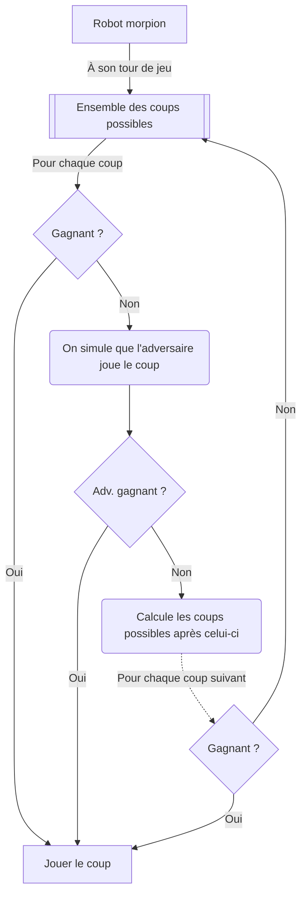

## Structure application

```mermaid
flowchart LR
    U("Utilisateur") -->|Interagie| Navigator
    subgraph Navigator["Partie navigateur (Frontend; HTML, CSS, JS)"]
        direction TB
        D["Page de connexion"]
        A["Page HTML du jeu"]
        C(["sendScore.js"])
        F(["Formulaire envoyé"])
    end
    subgraph Server["Partie serveur (Backend) main.py"]
        direction TB
        J("Servir les fichiers HTML, CSS, JS et images")
        E("Authentification")
        H("Enregistrement scores")
    end
    D --> F
    F --> E
    E .-> |Cookie avec jeton| Navigator
    C --> |Sauvegarder| H
    A -->|Gagne une partie| C
    E & H <--> BDD[("Base de données Sqlite")]
```

## Bot du morpion

```mermaid
flowchart TD
    A["Robot morpion"] --> |À son tour de jeu| Possibilities[["Ensemble des coups possibles"]]
    Possibilities -->|Pour chaque coup| B{"Gagnant ?"}
    B --> |Oui| C["Jouer le coup"]
    B --> |Non| O("On simule que l'adversaire joue le coup")
    O --> D{"Adv. gagnant ?"}
    D --> |Oui| C
    D --> |Non| E("Calcule les coups possibles après celui-ci")
    E .-> |Pour chaque coup suivant| J{"Gagnant ?"}
    J --> |Oui| C
    J --> |Non| Possibilities
```
