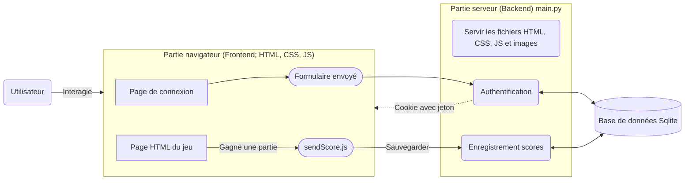
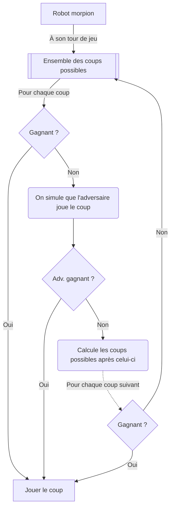

## Structure application

[](https://mermaid.live/edit#pako:eNqNU11u2zAMvgqhhyEB3BwgGwYkdrysaIdhbl9W94G1GFutLXn6yRbUPVDP0YuNttc62V4mwIBJfvxEfqQeRWEkiaXY1eZnUaH1cPEt18DnepaLa69q5dBTsLmYw9nZx-6z9mSxVNTBF9yrEr2xY4ILd6XFtpr8N7n4ypSKQI8u5oFZag1zaPketleXFxHEWRbBeTbPxe1I1B-pLBVeGQ1X68mbDIwlgSQojNb0ixEneatXRM8NMsA9hRNAPGOE4-uzwlha3DuOzqdw2odTY5tQI5cApPfm8PI8gTjzr3Yzsns66tX1dt_oGosHhs-hQaUX7eE_Gjxn0Xs-ZaEmBztVVIqsO1UKyINquEmu_aj0Deeugq9Ie8WJ6AdtjgBbBmy0pVI5b6lhHLhehInmrbmknzWko5EOxmY0NrBgo4uNeeBecU8FS-yN_mcd4iGryzDsqUQryXawHUOrYZM-YakJAn_tIFwH8esV72ALH_r0dZLccNVrdMPMJc_85ZmFyX7UyhPXfSsi0ZBlhSVv8WNPkAvWoOHgkn8l7TDUPhe5fmIoBm-ygy7E0ttAkQit5K1MFPIoG7HcYe3YS1JxG5fjyxgeSCRa1N-NmTDWhLL6Yz39BpjiBlA)

Code mermaid

    

## Bot du morpion

Code mermaid

    

